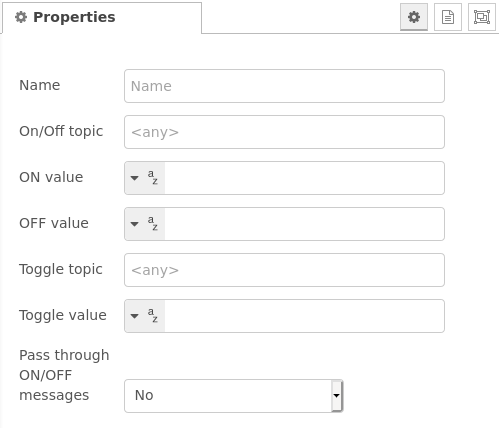

# node-red-contrib-toggle
Toggle switch node for Node-red.

This node is a companion for any switch (physical or virtual), storing its state and providing toggle operation
without need of using function nodes or flow/global variables.

  
**Fig. 1:** Node appearance

## Installation

### In Node-RED (preferred)
* Via Manage Palette -> Search for "node-red-contrib-toggle"

### In a shell
* go to the Node-RED installation folder, e.g.: `~/.node-red`
* run `npm install node-red-contrib-toggle`

## Usage

### Node Configuration
The node configuration sets the active on/off/toggle keywords as well as optional topic names.

  
**Fig. 2:** Node properties

#### ON value / OFF value / Toggle value
These attributes can be of type
* string
* number
* boolean

They are set to the values you want to be the keywords within `msg.payload` when the actions **switch to ON**, **switch to OFF** and **toggle** shall take place (*execution command*).

**Remark:** If you do not set a value to one of the attributes the according method (e.g. switch ON) can not be executed by the node (it needs a value to compare...).

#### On/Off topic resp. Toggle topic (optional)
If you set the topic attributes to a value, the input `msg` needs to contain the same topic name to execute **On/Off** resp. **toggle** in addition to the `msg.payload` value containing the execution command.

#### Pass through ON/OFF messages
The node has three pass through modes:  
 - ***No*** - means that node sends an output `msg` only when state is toggled. ON/OFF input messages just update internal state of the node.
 - ***If changed*** - sends an output `msg` for ON/OFF input message only once it differs from the previous state. And obviously message is always sent for "toggle" message.
 - ***Always*** - the output `msg` is always sent as a reaction on an input `msg`.

### Input
The input `msg.payload` contains the **execution command** to the node.  
The value needs to be identical to the values you configured in the configuration dialog.

If a (string) value is set to the configuration attributes ***On/Off topic*** or ***Toggle topic***, the `msg.topic` property must contain the same string value to execute the command given in `msg.payload`.

An example `msg` contents is shown for ***On/Off topic*** = "onofftopic":

  
**Fig. 3:** Example `msg` when using topics

### Output
The input `msg` is forwarded to the output, if a valid switch command was detected.  
The configuration attribute ***pass through ON/OFF messages*** is taken into account.

### Node status
The node status signals:
- If the switch status is ***on*** it shows a green dot with the text **ON**.
- If the switch status is ***off*** it shows a red dot with the text **OFF**.

Initially it shows no state.

## Examples
***
**Remark**: Example flows are present in the examples subdirectory. In Node-RED they can be imported via the import function and then selecting *Examples* in the vertical tab menue.
***

### Example 1: Basic on/off usage
This example shows the basic usage of the on and off commands.  
The configuration is set to **boolean** `true` resp. `false` to switch on resp. switch off and **no toggle option**.

[**BasicUsage.json**](examples/BasicUsage.json)  
**Fig. 4:** Basic usage example

### Example 2: Basic toggle usage
This example shows the basic usage of the toggle command.  
The configuration is set to **boolean** `true` resp. `false` and to toggle with all other `msg.payload`/`msg.topic` combinations.

[**ToggleUsage.json**](examples/ToggleUsage.json)  
**Fig. 5:** Toggle usage example

### Example 3: Usage with topics
This example shows the usage of topics.  
The configuration is set to **strings** (`switchON`, `switchOFF`) to switch on resp. off and a **string** (`toggleSTATE`) to toggle the switch.  
Additionally, the topics are set to `onofftopic` (for the commands `switchON` and `switchOFF`) and to `toggletopic` for the toggle operation (command `toggleSTATE`).

[**TopicUsage.json**](examples/TopicUsage.json)  
**Fig. 6:** Topic usage example

## Version history
v0.1.0 Docu rework

v0.0.2 Docs updated

v0.0.1 Initial release

## Credits
- [eschava](https://github.com/eschava)
- [StephanStS](https://github.com/StephanStS)
